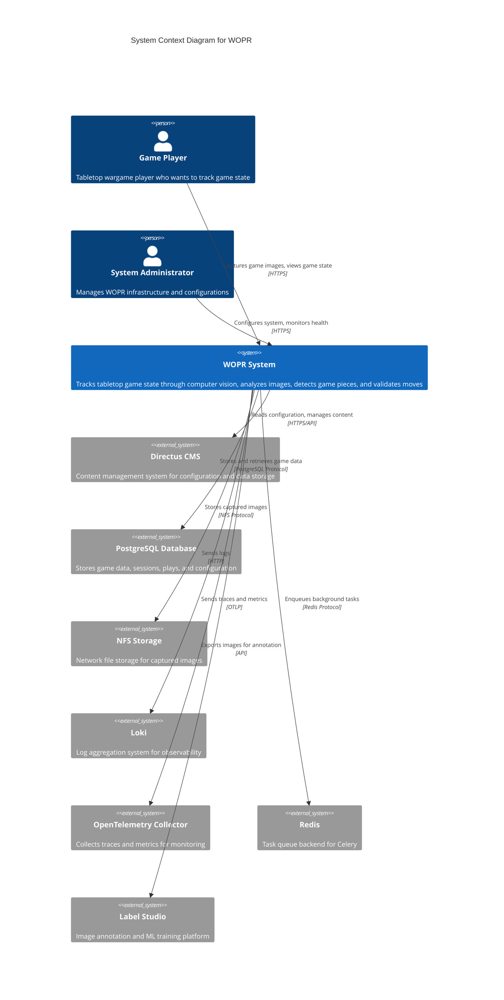

# C4 Model: System Context Diagram

## WOPR - Wargaming Oversight & Position Recognition

## Description

The WOPR (Wargaming Oversight & Position Recognition) system is a computer vision-based application that tracks the state of tabletop wargames. The system context shows:

### Actors
- **Game Players**: Primary users who capture overhead images of their game boards through a web interface
- **System Administrators**: Manage the WOPR infrastructure, configurations, and monitoring

### WOPR System
The core system that provides:
- Image capture from overhead cameras
- Computer vision analysis of game pieces
- Game state tracking and validation
- Session and play management
- Web-based user interface

### External Systems

**Data Storage & Management:**
- **Directus CMS**: Provides content management and API for configuration data
- **PostgreSQL Database**: Primary data store for games, sessions, plays, players, and system configuration
- **NFS Storage**: Centralized file storage for captured game board images

**Observability & Monitoring:**
- **Loki**: Log aggregation for centralized logging across all services
- **OpenTelemetry Collector**: Collects distributed traces and metrics for system observability

**Task Processing:**
- **Redis**: Message broker backend for Celery task queue, handles asynchronous jobs like image archiving

**Machine Learning:**
- **Label Studio**: External platform for image annotation and training ML models for game piece detection

## Assumptions

1. **Network connectivity**: All external systems are accessible via network (local or cloud)
2. **Authentication**: Directus handles user authentication (implementation details not visible in code)
3. **Camera hardware**: Physical camera devices (EMEET SmartCam C960 4K mentioned) connected to system
4. **Deployment environment**: System appears designed for Kubernetes deployment based on references to k8s probes
5. **Domain**: System accessible via `tailandtraillabs.org` domain

## Key Interfaces

- **HTTPS/Web**: User-facing interfaces for game interaction
- **PostgreSQL Protocol**: Database connections for data persistence
- **NFS Protocol**: File system access for image storage
- **HTTP/OTLP**: Observability data transmission
- **Redis Protocol**: Task queue communication

## External Dependencies

The system has significant external dependencies on:
- Database availability (PostgreSQL)
- File storage (NFS)
- Observability infrastructure (Loki, OpenTelemetry)
- Task queue (Redis)
- Content management (Directus)