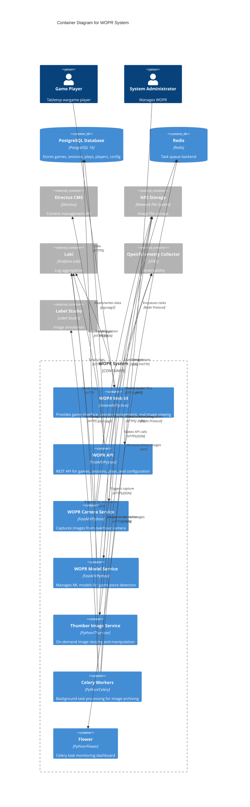

# C4 Model: Container Diagram

## WOPR - System Containers

## Container Descriptions

### User-Facing Containers

**WOPR Web UI** (Streamlit/Python, Port 8501)
- **Purpose**: Primary user interface for game players
- **Technology**: Streamlit web framework
- **Responsibilities**:
  - Game selection and session creation
  - Round management (start/end rounds)
  - Image capture triggering
  - Session and play viewing
  - Administrative interfaces
- **Key Files**: `systems/wopr-web/container/`
- **Dependencies**: httpx, streamlit, pydantic

**WOPR API** (FastAPI/Python, Port 8000)
- **Purpose**: Core REST API service
- **Technology**: FastAPI with Uvicorn ASGI server
- **Responsibilities**:
  - CRUD operations for games, sessions, plays, players
  - Configuration management
  - Session lifecycle management
  - Task orchestration (archiving, export)
  - Direct database access via Directus client
- **Key Files**: `systems/wopr-api/container/`
- **Endpoints**: 
  - `/api/v2/games`, `/api/v2/session`, `/api/v2/plays`
  - `/api/v2/config`, `/api/v2/tasks`
- **Instrumentation**: OpenTelemetry for tracing

### Backend Services

**WOPR Camera Service** (FastAPI/Python, Port 8080)
- **Purpose**: Hardware camera interface
- **Technology**: FastAPI with picamera2 and OpenCV
- **Responsibilities**:
  - POST /capture endpoint for image capture
  - Interfaces with EMEET SmartCam C960 4K camera
  - Saves images to NFS with session-specific naming
- **Key Files**: `systems/wopr-cam/`
- **Hardware**: Physical camera with 3D printed overhead mount

**WOPR Model Service** (FastAPI/Python, Port 8000)
- **Purpose**: ML model management
- **Technology**: FastAPI
- **Responsibilities**:
  - Model status checking and validation
  - Model file management (backup, distfile checking)
  - Model metadata tracking
- **Key Files**: `systems/wopr-model/container/`

**Thumbor Image Service** (Thumbor/Python, Port 8888)
- **Purpose**: Dynamic image transformation
- **Technology**: Thumbor image server
- **Responsibilities**:
  - On-demand image resizing
  - Image format conversion
  - Thumbnail generation
  - Image optimization
- **Key Files**: `systems/wopr-thumbor/container/`

**Celery Workers** (Python/Celery)
- **Purpose**: Asynchronous task processing
- **Technology**: Celery with Redis backend
- **Responsibilities**:
  - `archive_session_images`: Move images from incoming to archive
  - `check_labelstudio_files`: Verify Label Studio exports
  - `session_archive_status`: Check file locations
  - Best-effort file operations with error tracking
- **Key Files**: `systems/wopr-api/container/app/tasks/`

**Flower** (Python/Flower, Port 5555)
- **Purpose**: Celery task monitoring
- **Technology**: Flower web dashboard
- **Responsibilities**:
  - Real-time task monitoring
  - Worker status tracking
  - Task history and statistics

### Data Stores

**PostgreSQL Database** (PostgreSQL 16)
- **Purpose**: Primary data persistence
- **Tables** (Directus schema):
  - `games` - Game catalog (name, description, players, rules)
  - `sessiontracker` - Game sessions with UUID
  - `playtracker` - Individual plays/moves with filenames
  - `players` - Player information
  - `config` - System configuration
- **Access**: Via Directus API client

**Redis** (Redis)
- **Purpose**: Task queue and caching
- **Usage**: Celery broker and result backend

### External Systems

**Directus CMS**
- Provides REST API abstraction over PostgreSQL
- Content management interface
- Used by WOPR API via `directus_client.py`

**NFS Storage**
- **Structure** (assumed):
  - `/incoming/` - Newly captured images
  - `/archive/` - Archived session images
  - `/labelstudio/` - Images exported for annotation
  - `/models/` - ML model files

## Communication Patterns

### Synchronous (HTTP/HTTPS)
- Web UI → API: REST calls for all data operations
- Web UI → Thumbor: Image requests with transformation parameters
- API → Camera: Capture triggers
- API → Model Service: Model status queries
- API → Directus: Configuration and data access

### Asynchronous (Task Queue)
- API → Redis → Workers: Task dispatch
- Tasks include file operations that shouldn't block API requests

### Database
- Direct PostgreSQL connections via psycopg3 (async support)
- Pooled connections for performance

### Observability
- Structured logs → Loki (all containers)
- Distributed traces → OpenTelemetry Collector (API, Camera)
- Task metrics → Flower dashboard

## Deployment Notes

### Containerization
- All services are containerized (Dockerfiles present)
- Non-root users (UID 2222 for 'wopr' user)
- Python 3.11-3.13 base images
- Multi-stage builds for optimization

### Port Mapping
- Web UI: 8501
- API: 8000
- Camera: 8080
- Model Service: 8000
- Thumbor: 8888
- Flower: 5555 (assumed)

### Environment Variables
- `DATABASE_URL`: PostgreSQL connection string
- `WOPR_API_URL`: API base URL (https://api.wopr.tailandtraillabs.org)
- `OTEL_EXPORTER_OTLP_ENDPOINT`: Observability endpoint
- Camera and model services read from config API

## Assumptions

1. **Directus deployment**: External or co-deployed Directus instance
2. **NFS mount**: All containers requiring file access have NFS mounted
3. **Network**: All containers in same network or via ingress/service mesh
4. **Scaling**: API and workers can scale horizontally
5. **Camera hardware**: Camera service runs on host with camera access or uses USB passthrough
6. **Database schema**: Managed by Directus migrations
7. **TLS termination**: Handled by ingress controller/reverse proxy

## Security Considerations

- Non-root container users
- No hardcoded credentials visible (environment-based)
- PostgreSQL connections should use TLS (not verified in code)
- API authentication mechanism not evident (likely via Directus)

## Missing Information

- Load balancer/ingress configuration
- Database connection pooling parameters
- Redis sentinel/cluster configuration
- NFS mount specifications and paths
- Camera hardware connection method (USB, network)
- Authentication and authorization flows
- Rate limiting and throttling
- Backup and disaster recovery procedures