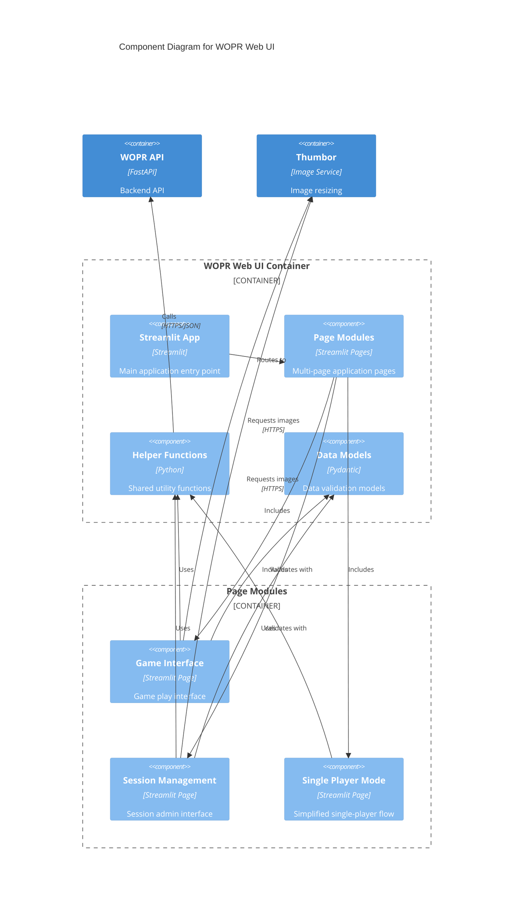

# C4 Model: Component Diagram

## WOPR API - Component Breakdown

```mermaid
C4Component
    title Component Diagram for WOPR API Service

    Container_Boundary(api, "WOPR API Container") {
        Component(main, "Main Application", "FastAPI", "Application entry point, middleware, routing")
        Component(routers, "API Routers", "FastAPI Router", "Endpoint handlers for different resources")
        Component(directus, "Directus Client", "Python Module", "Abstraction layer for database access")
        Component(tasks, "Task Definitions", "Celery Tasks", "Async task definitions")
        Component(celery_app, "Celery Application", "Celery", "Task queue configuration")
        Component(crud, "CRUD Router Generator", "Python Generic", "Generic CRUD endpoint factory")
        Component(logging, "Logging Module", "Python Logging", "Centralized logging configuration")
        Component(globals, "Global Config", "Python Module", "Application-wide constants and settings")
        Component(safefile, "SafeFS Module", "Python", "Safe file operations with error handling")
    }

    Container_Boundary(routers_detail, "API Routers") {
        Component(games_router, "Games Router", "FastAPI Router", "Game catalog CRUD operations")
        Component(session_router, "Session Router", "FastAPI Router", "Session management and lifecycle")
        Component(plays_router, "Plays Router", "FastAPI Router", "Play tracking CRUD")
        Component(config_router, "Config Router", "FastAPI Router", "Configuration management")
        Component(tasks_router, "Tasks Router", "FastAPI Router", "Task status and triggering")
    }

    Container_Boundary(tasks_detail, "Background Tasks") {
        Component(archive_task, "Archive Session Images", "Celery Task", "Moves images to archive")
        Component(labelstudio_task, "Check Label Studio", "Celery Task", "Verifies Label Studio exports")
        Component(status_task, "Archive Status Check", "Celery Task", "Checks file locations")
    }

    ContainerDb(postgres, "PostgreSQL", "Database", "Data persistence")
    ContainerDb(redis, "Redis", "Cache/Queue", "Task queue backend")
    Container(nfs, "NFS Storage", "File System", "Image storage")
    Container(otel, "OpenTelemetry", "Observability", "Tracing")

    Rel(main, routers, "Routes requests to")
    Rel(main, logging, "Configures")
    Rel(main, globals, "Reads config from")
    Rel(main, otel, "Instruments with", "OTLP")

    Rel(routers, games_router, "Includes")
    Rel(routers, session_router, "Includes")
    Rel(routers, plays_router, "Includes")
    Rel(routers, config_router, "Includes")
    Rel(routers, tasks_router, "Includes")

    Rel(games_router, directus, "Uses")
    Rel(session_router, directus, "Uses")
    Rel(plays_router, directus, "Uses")
    Rel(config_router, directus, "Uses")
    
    Rel(games_router, crud, "Extends")
    Rel(plays_router, crud, "Extends")
    
    Rel(tasks_router, celery_app, "Dispatches tasks via")
    Rel(tasks_router, tasks, "Triggers")
    
    Rel(directus, postgres, "Queries", "psycopg3")
    
    Rel(celery_app, redis, "Connects to", "Redis Protocol")
    Rel(tasks, celery_app, "Registered with")
    
    Rel(archive_task, directus, "Reads session data")
    Rel(archive_task, safefile, "Uses for file ops")
    Rel(archive_task, nfs, "Moves files on")
    
    Rel(labelstudio_task, safefile, "Uses for checks")
    Rel(labelstudio_task, nfs, "Checks files on")
    
    Rel(status_task, safefile, "Uses for checks")
    Rel(status_task, nfs, "Checks files on")

    UpdateLayoutConfig($c4ShapeInRow="3", $c4BoundaryInRow="2")
```



## Component Details

### Core Application Components

#### Main Application (`app/main.py` or `app/app.py`)
- **Responsibility**: Application initialization and configuration
- **Key Functions**:
  - FastAPI app instantiation
  - Middleware registration (CORS, OpenTelemetry)
  - Router inclusion
  - Lifespan events (startup/shutdown)
  - Health check endpoint
- **Dependencies**: FastAPI, OpenTelemetry instrumentation

#### API Routers (`app/api/v2/`)
Modular router components for different resource types:

**Games Router** (`app/api/v2/games.py`)
- **Endpoints**:
  - `GET /api/v2/games` - List all games
  - `GET /api/v2/games/{game_id}` - Get game details
  - `POST /api/v2/games` - Create new game
  - `PATCH /api/v2/games/{game_id}` - Update game
  - `DELETE /api/v2/games/{game_id}` - Delete game
- **Data Model**: Game catalog (name, description, min/max players, URL, status)

**Session Router** (`app/api/v2/session.py`)
- **Endpoints**:
  - `GET /api/v2/session/new/{game_id}` - Create new session
  - `POST /api/v2/session/capture` - Trigger image capture
  - `GET /api/v2/session/{session_id}` - Get session details
  - Custom endpoints for session lifecycle
- **Responsibilities**: Session creation, UUID generation, capture coordination

**Plays Router** (`app/api/v2/plays.py`)
- **Endpoints**: Standard CRUD for playtracker table
- **Data Model**: Play records with session ID, player ID, filename, notes, timestamps

**Config Router** (`app/api/v2/config.py`)
- **Endpoints**:
  - `GET /api/v2/config/all` - Get all configuration
  - Environment-based config filtering
- **Responsibilities**: Serve configuration to other services

**Tasks Router** (`app/api/v2/tasks.py`)
- **Endpoints**:
  - Trigger archive tasks
  - Check task status
  - Query task results
- **Responsibilities**: Celery task orchestration

#### Directus Client (`app/directus_client.py`)
- **Purpose**: Database abstraction layer
- **Functions**:
  - `get_one(table, id)` - Fetch single record
  - `get_all(table, filters)` - Fetch multiple records
  - `post(table, data)` - Create record
  - `update(table, id, data)` - Update record
  - `delete(table, id)` - Delete record
- **Implementation**: Direct PostgreSQL queries via psycopg3
- **Naming**: "Directus" suggests original design used Directus CMS, now direct DB access

#### CRUD Router Generator (`app/lib/crud.py`)
- **Purpose**: Generic CRUD endpoint factory
- **Type**: Python Generic class using TypeVar
- **Benefits**: Reduces boilerplate for standard CRUD operations
- **Usage**: Games and Plays routers extend this pattern
- **Features**:
  - Automatic endpoint registration
  - Type-safe request/response models
  - Consistent error handling

### Background Task Components

#### Celery Application (`app/celery_app.py`)
- **Configuration**:
  - Broker: Redis
  - Result backend: Redis
  - Task serialization: JSON
  - Result expiration policy
- **Responsibilities**: Task queue initialization and management

#### Task Definitions (`app/tasks/`)

**Session Tasks** (`app/tasks/session_tasks.py`)

1. **archive_session_images**
   - **Input**: session_id (str)
   - **Process**:
     - Fetch session data and UUID
     - Get all play filenames for session
     - Move files from incoming/ to archive/
     - Best-effort: continues on individual failures
   - **Output**: Dict with success/failure lists
   - **Error Handling**: Catches ExistsError, NotFoundError

2. **check_labelstudio_files**
   - **Purpose**: Verify Label Studio export completeness
   - **Process**: Check if session images exist in labelstudio directory
   - **Output**: File existence status

3. **session_archive_status**
   - **Purpose**: Report file locations for session
   - **Process**: Check incoming, archive, labelstudio directories
   - **Output**: Dict mapping files to locations

**Helper Functions**:
- `_get_session_data(session_id)` - Fetch and validate session
- `_get_session_filenames(session_id)` - Extract filenames from plays

### Utility Components

#### SafeFS Module (`app/lib/safe_file.py`)
- **Purpose**: Safe file system operations
- **Features**:
  - Path validation and sanitization
  - Atomic file operations
  - Custom exceptions (ExistsError, NotFoundError)
  - Prevents directory traversal attacks
  - Logging of all operations
- **Methods** (inferred):
  - `move(src, dst)` - Safe file move
  - `exists(path)` - File existence check
  - `copy(src, dst)` - Safe file copy

#### Logging Module (`app/logging.py`)
- **Purpose**: Centralized logging configuration
- **Function**: `configure_logging(log_file)`
- **Features**:
  - Structured logging
  - File and console handlers
  - Log level management
  - Integration with OpenTelemetry for trace correlation

#### Global Config (`app/globals.py`)
- **Purpose**: Application-wide constants
- **Variables** (inferred):
  - `APP_NAME` - "wopr-api"
  - `LOGFILE` - "/var/log/wopr-api.log"
  - `DATABASE_URL` - PostgreSQL connection string
  - Environment variables

## WOPR Web UI - Component Breakdown



### Web UI Components

#### Main App (`app/app.py`)
- **Purpose**: Streamlit application entry point
- **Configuration**:
  - Page layout: wide
  - Multi-page routing
  - Session state initialization

#### Page Modules

**Game Interface** (`app/pages/game-v1.py`, `game-singleplayer-v2.py`)
- **Features**:
  - Game selection dropdown
  - Session creation
  - Round management (start/end)
  - Image capture triggering
  - Turn-based play tracking
- **Session State**:
  - `session_uuid` - Current session identifier
  - `current_round` - Round counter
  - `round_started` - Round state flag
  - `selected_game` - Game metadata
  - `turn_phrase` - Randomized flavor text
  - `playnote` - User notes for moves

**Session Management** (`app/pages/session-maininterface.py`)
- **Features**:
  - Session list/search
  - Session archiving
  - Play record viewing
  - Task status monitoring
  - Bulk operations
- **Tabs**:
  - Session list
  - Jobs interface (Celery tasks)
  - Session details

#### Helper Functions (`app/helpers.py`)
- **API Wrapper Functions** (inferred):
  - `get_all(resource)` - Fetch all records
  - `get_one(resource, id)` - Fetch single record
  - `update_item(resource, id, data)` - Update record
  - `get_session_plays(session_id)` - Get plays for session
  - `all_session_tasks()` - Query Celery task status
- **Utilities**:
  - Caching decorators for API calls
  - Error handling wrappers
  - Data formatting helpers

#### Data Models (`app/models/models.py`)
- **ModelStatus**: ML model metadata (name, backed up, checksum, distfile)
- Additional models for games, sessions, plays (likely mirrors API models)

## WOPR Camera Service - Component Breakdown

### Components

**Main Application** (`app/app.py`)
- FastAPI application with single endpoint

**Capture Endpoint** (`POST /capture`)
- **Input**: JSON payload with camid, filename, sessionuuid
- **Process**:
  - Initialize camera (picamera2 or OpenCV depending on hardware)
  - Capture image
  - Save to NFS with provided filename
  - Return image path and metadata
- **Hardware Interface**: EMEET SmartCam C960 4K camera
- **OpenTelemetry**: Instrumented for tracing

**WOPR Core Module** (imported from `git+https://github.com/travismontana/wopr.git#subdirectory=pymods/wopr-core`)
- Shared library for configuration and common utilities
- Mounted via pip install from GitHub subdirectory

## WOPR Model Service - Component Breakdown

### Components

**Main Application** (`app/app.py`)
- FastAPI application for model management

**Models Router** (`app/api/models.py`)
- **Endpoints**:
  - Model status checks
  - Model backup verification
  - Distfile availability
  - Checksum validation

**Helper Functions** (`app/lib/helpers.py`)
- `get_config()` - Load configuration
- `get_all(resource)` - Fetch model list
- Storage path management

**State Management** (`app.state`)
- `app.state.models` - Cached model list
- `app.state.paths` - Storage path configuration
- `app.state.config` - Runtime configuration

## Cross-Cutting Concerns

### Configuration Management
- **Source**: PostgreSQL config table via API
- **Caching**: Services cache config locally
- **Environment-based**: Different configs for dev/staging/prod
- **Structure**:
  ```python
  {
    "storage": {
      "base_path": "/mnt/nfs",
      "models_subdir": "models",
      "models_backup_subdir": "backups"
    }
  }
  ```

### Logging
- **Standard**: Python logging module
- **Format**: Structured JSON logs
- **Destination**: Local files + Loki
- **Correlation**: Trace IDs from OpenTelemetry

### Error Handling
- **API**: HTTPException with status codes
- **Tasks**: Try-catch with error logging, best-effort completion
- **File Operations**: Custom exceptions (SafeFS)

### Database Access
- **Pattern**: Repository/Client pattern via Directus client
- **Transactions**: Handled at client level
- **Connection Pooling**: Implicit via psycopg3

## Assumptions

1. **Directus Client**: Originally designed for Directus CMS, now direct PostgreSQL access
2. **File Paths**: NFS paths are consistent across containers (shared mount)
3. **Task Idempotency**: Tasks can be safely retried
4. **Session State**: Streamlit session state is ephemeral (server-side or cookie-based)
5. **Image Naming**: Convention-based (game-{uuid}-round{n}-{suffix}.jpg)
6. **API Versioning**: /api/v2 implies v1 existed or planned
7. **Authentication**: Handled at API gateway/ingress level (not in application code)