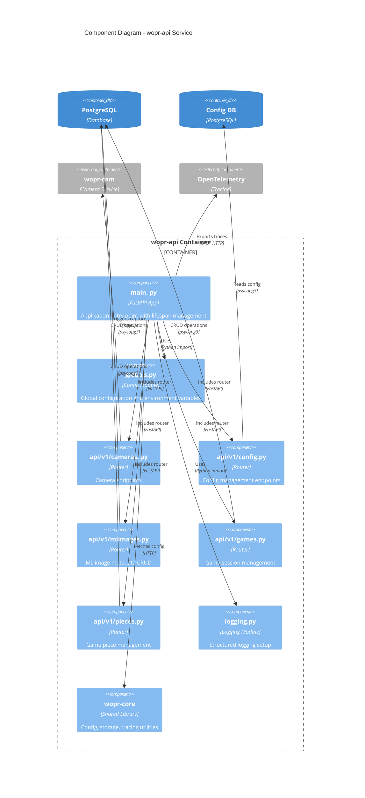

# WOPR Component Diagram - wopr-api Service

This diagram shows the internal components of the wopr-api service.

# Key Components
main.py: FastAPI app with OpenTelemetry instrumentation, CORS middleware, lifespan events
API Routers: RESTful endpoints for cameras, games, pieces, ML images, config
wopr-core Library: Shared Python module for config (wopr. config), storage (wopr.storage), logging (wopr.logging), tracing (wopr.tracing)
Database Connections: psycopg3 connections with context managers for PostgreSQL access