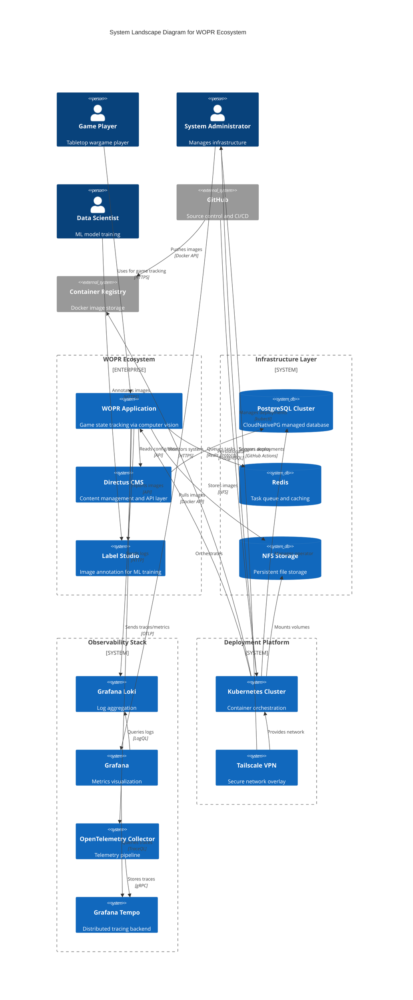

# C4 Model: System Landscape Diagram

## WOPR Ecosystem - System Landscape



## System Landscape Overview

The WOPR system landscape shows the complete ecosystem including the core application, supporting infrastructure, observability stack, and deployment platform.

### Enterprise Systems

#### WOPR Application
The primary system for tracking tabletop wargame state through computer vision. Composed of multiple microservices (API, Web, Camera, Model, Workers) deployed as containers.

#### Directus CMS
Content management system providing:
- REST API abstraction over PostgreSQL
- Admin interface for configuration
- User authentication and authorization (assumed)
- Content versioning and workflow

#### Label Studio
External platform for:
- Manual image annotation
- ML model training data preparation
- Quality assurance of automated detection
- Collaborative annotation workflows

### Infrastructure Layer

#### PostgreSQL Cluster (CloudNativePG)
- **Operator**: CloudNativePG Kubernetes operator
- **High Availability**: Multi-instance cluster with automatic failover
- **Backups**: Automated backup scheduling (assumed)
- **TLS**: Certificate management via operator
- **DNS**: Internal service DNS (cluster-rw, cluster-ro, cluster-r)
- **Management**: Managed via `studioctl.py` CLI tool

**Configuration** (from `scripts/studioctl.py`):
```yaml
apiVersion: postgresql.cnpg.io/v1
kind: Cluster
metadata:
  name: {cluster_name}
spec:
  instances: 1-3
  storage:
    size: 10Gi-100Gi
  certificates:
    serverAltDNSNames:
      - {cluster}-rw.abode.tailandtraillabs.org
      - {cluster}-ro.abode.tailandtraillabs.org
```

#### Redis
- **Purpose**: Celery broker and result backend
- **Deployment**: Likely Kubernetes StatefulSet or managed service
- **Persistence**: Configuration not visible (volatile vs persistent)
- **Clustering**: Single instance or cluster mode unknown

#### NFS Storage
- **Purpose**: Shared persistent storage across pods
- **Structure** (inferred):
  - `/incoming/` - Newly captured images
  - `/archive/` - Archived session images
  - `/labelstudio/` - Exported for annotation
  - `/models/` - ML model files
  - `/backups/` - Model backups
- **Access**: ReadWriteMany PersistentVolumeClaims
- **Provider**: Unknown (NFS server, cloud file system, or storage appliance)

### Observability Stack

#### Grafana Loki (Log Aggregation)
- **Purpose**: Centralized logging for all WOPR services
- **Query Language**: LogQL for log queries
- **Integration**: All containers ship logs via HTTP
- **Filters**: Application-level filtering of health checks and k8s probes
- **Labels**: Namespace, app, pod for log organization

**Example LogQL** (from `systems/wopr-ai/README.md`):
```logql
{namespace="prod", app="wopr-api"}
|~ "(?i)\\b(error|err|warn|warning)\\b"
!= "kube-probe"
| json
| label_format trace_id={{.trace_id}}
```

#### Grafana
- **Purpose**: Unified observability dashboard
- **Data Sources**: Loki (logs), Tempo (traces), Prometheus (metrics - assumed)
- **Dashboards**: System metrics, application metrics, trace visualization
- **Alerting**: Likely configured for error rates and system health

#### OpenTelemetry Collector
- **Purpose**: Telemetry pipeline and routing
- **Protocols**: OTLP over HTTP and gRPC
- **Exporters**: Tempo (traces), Prometheus (metrics - assumed)
- **Processing**: Sampling, batching, attribute manipulation

**WOPR Integration**:
- FastAPI auto-instrumentation
- httpx client instrumentation
- Log correlation via trace IDs

#### Grafana Tempo (Distributed Tracing)
- **Purpose**: Trace storage and querying
- **Query Language**: TraceQL
- **Visualization**: Trace timelines, service maps, span details
- **Integration**: Via OpenTelemetry Collector

### Deployment Platform

#### Kubernetes Cluster
- **Provider**: Unknown (self-hosted, cloud managed, or edge)
- **Domain**: `abode.tailandtraillabs.org` suggests home/private deployment
- **Ingress**: Traefik or nginx-ingress (not visible in code)
- **Networking**: Tailscale overlay network
- **Storage Class**: For NFS PVCs
- **Operators**: CloudNativePG for PostgreSQL management

**Key Resources**:
- Deployments for stateless services (API, Web, Camera, Model)
- StatefulSets for stateful services (Redis, Celery workers)
- Services for internal communication
- Ingress for external access
- ConfigMaps and Secrets for configuration
- PersistentVolumeClaims for NFS storage

#### Tailscale VPN
- **Purpose**: Secure overlay network
- **Features**:
  - Zero-trust networking
  - ACL-based access control
  - MagicDNS for service discovery
  - Encrypted mesh networking
- **Use Cases**:
  - Secure remote administration
  - Cross-cluster communication
  - Developer access to staging environments

### External Systems

#### GitHub
- **Source Control**: Git repository hosting
- **CI/CD**: GitHub Actions for automated builds
- **Artifact Storage**: GitHub Packages or external registry
- **Workflow** (assumed):
  1. Code push to main branch
  2. GitHub Actions builds Docker images
  3. Images pushed to registry
  4. Kubernetes deployment updated (GitOps or kubectl)

#### Container Registry
- **Options**: GitHub Container Registry, Docker Hub, Harbor, or private registry
- **Security**: Image scanning, vulnerability detection
- **Caching**: Pull-through cache for base images

## System Interactions

### User Workflows

**Game Player Workflow**:
1. Player accesses WOPR Web UI (via Tailscale or public ingress)
2. Selects game and creates session
3. Captures images during gameplay (Web UI → API → Camera → NFS)
4. Views game history and statistics
5. Archives completed sessions (triggers background tasks)

**Administrator Workflow**:
1. Admin connects via Tailscale VPN
2. Manages Kubernetes resources via kubectl
3. Monitors system health in Grafana
4. Manages database clusters with `studioctl.py`
5. Reviews logs in Loki for troubleshooting

**Data Scientist Workflow**:
1. Data scientist exports images from WOPR to Label Studio
2. Annotates game pieces and positions in Label Studio
3. Trains ML models with annotated data
4. Deploys updated models to WOPR Model Service

### Data Flows

**Image Capture Flow**:
```
Player → Web UI → API → Camera Service → NFS (incoming/)
                    ↓
                Database (play record with filename)
```

**Image Archiving Flow**:
```
API → Redis (task queue) → Celery Worker → NFS (incoming/ → archive/)
                                         ↓
                                   Database (update status)
```

**Label Studio Export Flow**:
```
API → Celery Worker → NFS (archive/ → labelstudio/)
                   ↓
              Label Studio API (create tasks)
```

**Observability Flow**:
```
All Services → Logs → Loki → Grafana (visualization)
           ↓
         Traces → OTel Collector → Tempo → Grafana
           ↓
        Metrics → OTel Collector → Prometheus → Grafana
```

## Deployment Architecture

### Domain Structure
- **Production**: `*.tailandtraillabs.org`
- **API**: `api.wopr.tailandtraillabs.org`
- **Web**: `wopr.tailandtraillabs.org` (assumed)
- **Monitoring**: `otel.monitoring.abode.tailandtraillabs.org`
- **Database**: `{cluster}-{rw/ro}.abode.tailandtraillabs.org`

### Network Architecture
```
Internet
   ↓
Tailscale VPN (secure overlay)
   ↓
Kubernetes Ingress (TLS termination)
   ↓
Service Mesh (optional - not confirmed)
   ↓
Pod Network (CNI)
   ↓
Containers
```

## Assumptions

1. **Kubernetes Distribution**: Likely k3s, RKE2, or managed Kubernetes (GKE, EKS, AKS)
2. **Ingress Controller**: Traefik or nginx-ingress with cert-manager for TLS
3. **Service Mesh**: Not implemented (no Istio/Linkerd references)
4. **GitOps**: Deployment automation via GitHub Actions or ArgoCD/Flux
5. **Monitoring**: Full Grafana stack (Loki, Tempo, Prometheus, Grafana)
6. **Backup Strategy**: PostgreSQL backups via CloudNativePG, NFS backups external
7. **Disaster Recovery**: Multi-zone database replicas, NFS replication
8. **Scaling**: Horizontal pod autoscaling for API and workers
9. **Security**: Network policies, pod security policies, RBAC
10. **Development**: Local development with docker-compose, staging environment in Kubernetes

## Missing Information

- Kubernetes cluster provider and version
- Ingress controller and TLS certificate management (cert-manager?)
- Service mesh implementation (if any)
- Prometheus deployment and configuration
- Backup retention policies and schedules
- Multi-environment strategy (dev, staging, prod)
- CI/CD pipeline details (GitHub Actions workflows)
- Container registry location and access controls
- Network policies and security boundaries
- Resource limits and autoscaling configurations
- Database replication and failover testing procedures
- NFS server details and performance characteristics