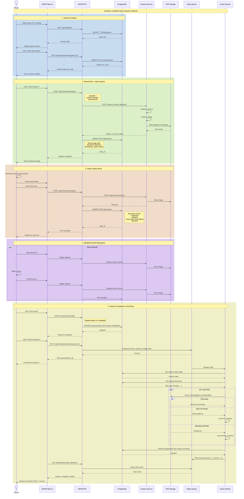
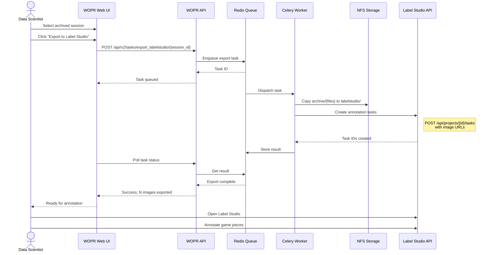
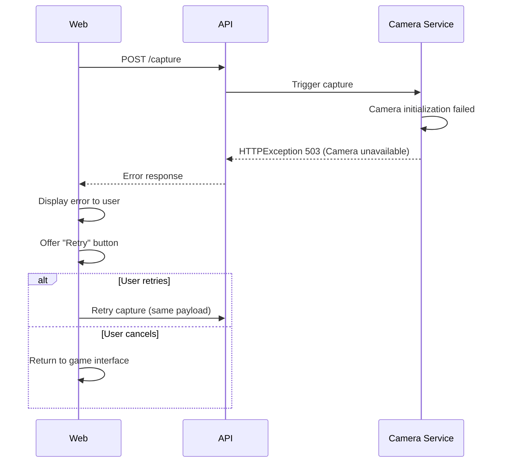
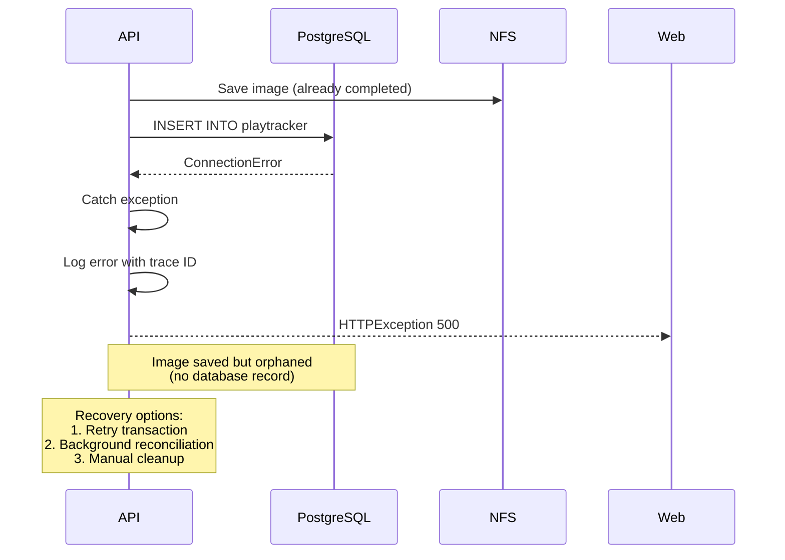

# C4 Model: Dynamic Diagram

## WOPR - Game Session Workflow



## Workflow Description

### 1. Session Creation (Player Initiates Game)

**Steps**:
1. Player browses available games in the web interface
2. Web UI fetches game catalog from API
3. API queries PostgreSQL for game list
4. Player selects a game and clicks "Start New Game"
5. API creates new session record with:
   - Auto-generated UUID (for filenames)
   - Game ID reference
   - Status: 'active'
   - Timestamp
6. Session data returned to player

**Key Data**:
- Session UUID: Used in all image filenames for this session
- Session ID: Database primary key for relationships

**Assumptions**:
- Player authentication happens before this flow (not shown)
- Game catalog is relatively static (cached in Web UI)

### 2. Round Start - Initial Capture

**Steps**:
1. Player clicks "Start Round N" button
2. Web UI sends capture request to API with:
   - Camera ID
   - Filename: `game-{uuid}-round{n}-start.jpg`
   - Session UUID
3. API forwards request to Camera Service
4. Camera Service:
   - Initializes camera hardware
   - Captures high-resolution image
   - Saves to NFS `/incoming/` directory
5. API creates play record in database:
   - Links to session via session_id
   - Stores filename for retrieval
   - Timestamp of capture
   - Status: 'active'
6. Web UI displays captured image via Thumbor (thumbnail)

**Error Handling**:
- Camera unavailable: Retry with exponential backoff
- NFS mount failure: Alert admin, queue for retry
- Database insert failure: Rollback, return error to user

### 3. Player Makes Move

**Steps**:
1. Player physically moves game pieces on the board
2. Player enters notes about the move in Web UI (optional)
3. Player clicks "End Turn" or "Capture Move"
4. Repeat of capture process with filename: `game-{uuid}-round{n}-play{p}.jpg`
5. Play record created with:
   - Move notes
   - Filename
   - Player ID
   - Timestamp

**Business Logic**:
- Each physical move captured for later review
- Notes provide context for automated analysis
- Timestamps enable replay of game progression

### 4. Multiple Rounds (Loop)

The capture process repeats for each round and turn:
- Start of round: Capture initial state
- Each turn: Capture after move
- End of round: Capture final state

**Typical Pattern**:
```
Round 1: start → player1-move1 → player2-move1 → ... → end
Round 2: start → player1-move1 → player2-move1 → ... → end
...
Round N: start → ... → end
```

**File Accumulation**:
- A 10-round game with 2 players and 5 moves per player per round:
  - 10 round-start images
  - 10 × 2 × 5 = 100 move images
  - 10 round-end images
  - **Total: 120 images per session**

### 5. Session Completion & Archiving

**Steps**:

**5a. Mark Session Complete**:
1. Player clicks "End Game"
2. API updates session status to 'completed'
3. Session no longer appears in "active sessions" list

**5b. Archive Files (Async)**:
1. Player or automated process triggers archiving
2. API enqueues Celery task with session ID
3. Task immediately returns task ID to player
4. Player sees "Archiving in progress..." with task ID

**5c. Background Processing** (Celery Worker):
1. Worker receives task from Redis queue
2. Queries database for session UUID and all play filenames
3. For each file:
   - Attempts to move from `/incoming/` to `/archive/`
   - Logs success or specific error (not found, already archived)
   - Continues to next file (best-effort)
4. Updates play records: status = 'archived'
5. Stores result summary in Redis:
   ```json
   {
     "success": ["file1.jpg", "file2.jpg"],
     "errors": [
       {"file": "file3.jpg", "error": "NotFoundError: already archived"},
       {"file": "file4.jpg", "error": "PermissionError: ..."}
     ]
   }
   ```

**5d. Result Polling**:
1. Web UI polls API for task status every 2-5 seconds
2. API queries Redis for task result
3. When complete, displays summary to player:
   - "120 files archived successfully"
   - "2 files had errors (see details)"

**Best-Effort Design**:
- Individual file failures don't fail entire archiving operation
- Errors logged for manual review
- Player notified of partial success

## Alternative Flow: Label Studio Export



## Error Scenarios

### Camera Failure During Capture



### Database Connection Lost During Play Creation



## Performance Considerations

### Concurrent Captures
Multiple players in different sessions can capture simultaneously:
- Camera Service: Queue requests or reject if busy
- NFS: Concurrent writes to different files (safe)
- Database: Concurrent inserts with different session IDs (safe)

### Large Archiving Jobs
Session with 500+ images:
- Task execution time: 5-10 minutes
- Chunked processing: 50 files at a time
- Progress updates: Store intermediate results
- Timeout protection: Celery task timeout set appropriately

### Image Retrieval
Player reviewing past games:
- Thumbnails: Generated on-demand by Thumbor, cached
- Full images: Direct NFS access via static file serving
- Pagination: Limit images per request (e.g., 20)

## Assumptions

1. **Single Camera**: System assumes one camera per deployment
2. **Synchronous Captures**: Player waits for capture to complete before continuing
3. **File System Latency**: NFS operations complete within 1-2 seconds
4. **Task Execution**: Workers process tasks within minutes, not hours
5. **Network Reliability**: Stable connections between containers
6. **Session Locking**: No concurrent modifications to same session (UI-enforced)
7. **Image Immutability**: Once captured, images never modified
8. **Archiving Idempotency**: Archiving task can be safely retried

## Missing Information

- Retry policies for failed captures
- Timeout values for camera operations
- Maximum concurrent users/sessions
- Image resolution and file sizes
- NFS performance characteristics
- Database transaction isolation levels
- Celery worker concurrency settings
- Task priority and routing
- Rollback procedures for failed operations
- Monitoring and alerting thresholds