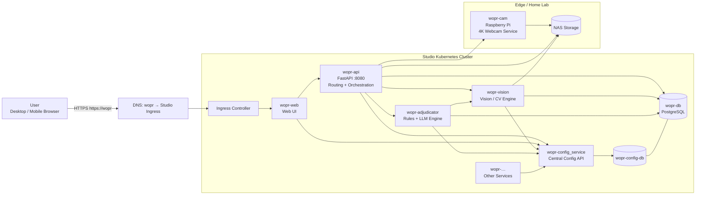

```mermaid
flowchart LR
  %% ===== Client =====
  U[User<br/>Desktop / Mobile Browser]
  DNS[DNS: wopr → Studio Ingress]

  U -->|HTTPS https://wopr| DNS

  %% ===== Studio Kubernetes Cluster =====
  subgraph K8S["Studio Kubernetes Cluster"]
    ING[Ingress Controller]
    WEB[wopr-web<br/>Web UI]
    API[wopr-api<br/>FastAPI :8080<br/>Routing + Orchestration]
    CFG[wopr-config_service<br/>Central Config API]
    VSN[wopr-vision<br/>Vision / CV Engine]
    ADJ[wopr-adjudicator<br/>Rules + LLM Engine]
    DB[(wopr-db<br/>PostgreSQL)]
    CFGDB[(wopr-config-db)]
    OTHER[wopr-…<br/>Other Services]
  end

  DNS --> ING
  ING --> WEB
  WEB --> API

  %% ===== Config flows =====
  API --> CFG
  WEB --> CFG
  VSN --> CFG
  ADJ --> CFG
  OTHER --> CFG

  %% ===== Core processing =====
  API --> CAM
  API --> VSN
  API --> ADJ
  ADJ --> VSN

  %% ===== Persistence =====
  API --> DB
  VSN --> DB
  ADJ --> DB
  CFG --> CFGDB
  CFGDB --- DB

  %% ===== Edge Devices =====
  subgraph EDGE["Edge / Home Lab"]
    CAM[wopr-cam<br/>Raspberry Pi<br/>4K Webcam Service]
    NAS[(NAS Storage)]
  end

  CAM --> NAS
  API --> NAS
  VSN --> NAS

```
