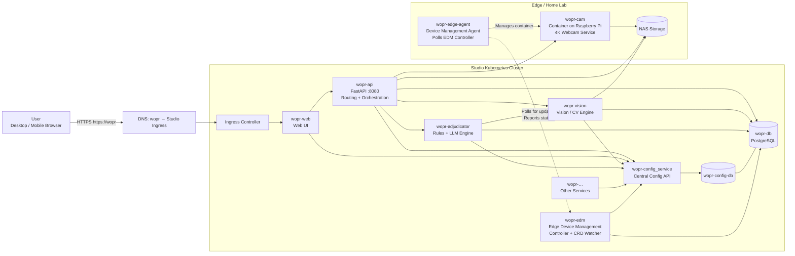

---

## Changes Made

**ADDED:**
- `wopr-edm` service in Studio cluster - Edge Device Management controller
- `wopr-edge-agent` on Raspberry Pi - Polls EDM, manages local containers
- Connection: Edge agent polls EDM controller for updates, reports status
- EDM uses config service and database for device state management
- Edge agent manages wopr-cam container (cam is now containerized)

**PHILOSOPHY:**
- EDM = k8s-style control plane for edge infrastructure
- Reconciliation loop pattern (desired vs actual state)
- Edge agent handles: container updates, rollbacks, health checks, status reporting
