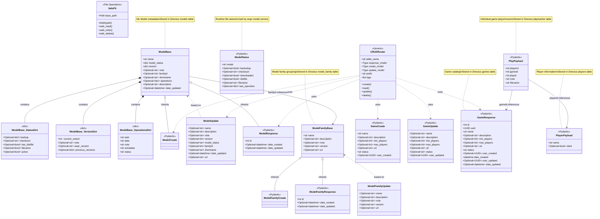

# data diagrams

```mermaid
classDiagram
    %% Model and ModelFamily classes
    class ModelBase {
        +str name
        +dict model_status
        +dict version
        +Optional~str~ note
        +Optional~int~ familyid
        +Optional~str~ shortname
        +Optional~dict~ operations
        +Optional~str~ description
        +Optional~datetime~ date_updated
    }

    class ModelBase_StatusDict {
        <<dict>>
        +Optional~dict~ backup
        +Optional~str~ checksum
        +Optional~bool~ has_distfile
        +Optional~bool~ filename
        +Optional~bool~ active
    }

    class ModelBase_VersionDict {
        <<dict>>
        +int~ current_vesion
        +Optional~str~ note
        +Optional~str~ wopr_version
        +Optional~dict~ previous_versions
    }

    class ModelBase_OperationsDict {
        <<dict>>
        +str task
        +str data
        +str note
        +str extradata
        +str status
    }

    class ModelCreate {
        <<Pydantic>>
    }

    class ModelUpdate {
        +Optional~str~ name
        +Optional~str~ description
        +Optional~str~ note
        +Optional~int~ version
        +Optional~str~ model_status
        +Optional~int~ familyid
        +Optional~str~ shortname
        +Optional~datetime~ date_updated
        +Optional~str~ url
    }

    class ModelResponse {
        <<Pydantic>>
        +int id
        +Optional~datetime~ date_created
        +Optional~datetime~ date_updated
    }

    class ModelFamilyBase {
        +str name
        +Optional~str~ description
        +Optional~str~ note
        +Optional~str~ version
        +Optional~str~ url
    }

    class ModelFamilyCreate {
        <<Pydantic>>
    }

    class ModelFamilyUpdate {
        +Optional~str~ name
        +Optional~str~ description
        +Optional~str~ note
        +Optional~str~ version
        +Optional~str~ url
    }

    class ModelFamilyResponse {
        <<Pydantic>>
        +int id
        +Optional~datetime~ date_created
        +Optional~datetime~ date_updated
    }

    class ModelStatus {
        <<Pydantic>>
        +str model
        +Optional~bool~ backedup
        +Optional~str~ checksum
        +Optional~bool~ downloaded
        +Optional~bool~ distfile
        +Optional~str~ filename
        +Optional~dict~ last_operation
    }

    %% Game-related classes
    class GameCreate {
        <<Pydantic>>
        +str name
        +Optional~str~ description
        +Optional~int~ min_players
        +Optional~int~ max_players
        +Optional~str~ url
        +str status
        +Optional~UUID~ user_created
    }

    class GameUpdate {
        <<Pydantic>>
        +Optional~str~ name
        +Optional~str~ description
        +Optional~int~ min_players
        +Optional~int~ max_players
        +Optional~str~ url
        +Optional~str~ status
        +Optional~UUID~ user_updated
    }

    class GameResponse {
        <<Pydantic>>
        +int id
        +UUID uuid
        +str name
        +Optional~str~ description
        +Optional~int~ min_players
        +Optional~int~ max_players
        +Optional~str~ url
        +str status
        +Optional~UUID~ user_created
        +datetime date_created
        +Optional~UUID~ user_updated
        +Optional~datetime~ date_updated
    }

    %% Player classes
    class PlayerPayload {
        <<Pydantic>>
        +str name
        +Optional~bool~ isbot
    }

    %% Play classes
    class PlayPayload {
        <<Pydantic>>
        +int playerid
        +int gameid
        +int playid
        +str note
        +str filename
    }

    %% Utility/Helper classes
    class CRUDRouter {
        <<Generic>>
        +str table_name
        +Type response_model
        +Type create_model
        +Type update_model
        +str prefix
        +list tags
        +create()
        +read()
        +update()
        +delete()
    }

    class SafeFS {
        <<File Operations>>
        +Path base_path
        +listdir(path)
        +safe_read()
        +safe_write()
        +safe_delete()
    }

    %% Relationships - Model hierarchy
    ModelBase <|-- ModelCreate :  inherits
    ModelBase <|-- ModelResponse : inherits
    ModelBase <..  ModelUpdate : based on

    ModelBase *-- ModelBase_StatusDict : contains
    ModelBase *-- ModelBase_VersionDict : contains
    ModelBase *-- ModelBase_OperationsDict : contains

    %% Relationships - ModelFamily hierarchy
    ModelFamilyBase <|-- ModelFamilyCreate : inherits
    ModelFamilyBase <|-- ModelFamilyResponse : inherits
    ModelFamilyBase <.. ModelFamilyUpdate : based on

    %% Relationships - Model to ModelFamily
    ModelBase --> ModelFamilyBase : familyid references


    %% Relationships - Usage by CRUDRouter
    CRUDRouter .. > ModelResponse : uses
    CRUDRouter ..> ModelCreate : uses
    CRUDRouter ..> ModelUpdate : uses
    CRUDRouter ..> GameResponse : uses
    CRUDRouter ..> GameCreate : uses
    CRUDRouter ..> GameUpdate : uses

    %% Relationships - Domain associations
    PlayPayload --> PlayerPayload : playerid references
    PlayPayload --> GameResponse : gameid references

    note for ModelBase "ML Model metadata\nStored in Directus models table"
    note for ModelFamilyBase "Model family grouping\nStored in Directus model_family table"
    note for ModelStatus "Runtime file status\nUsed by wopr-model service"
    note for GameResponse "Game catalog\nStored in Directus games table"
    note for PlayerPayload "Player information\nStored in Directus players table"
    note for PlayPayload "Individual game plays/moves\nStored in Directus playtracker table"
```