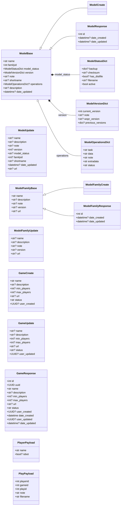

```mermaid
classDiagram
  direction LR

  %% =========================
  %% Nested dict-ish structures
  %% =========================
  class ModelStatusDict {
    +dict? backup
    +str? checksum
    +bool? has_distfile
    +str? filename
    +bool active
  }

  class ModelVersionDict {
    +int current_version
    +str? note
    +str? wopr_version
    +dict? previous_versions
  }

  class ModelOperationsDict {
    +str task
    +str data
    +str note
    +str extradata
    +str status
  }

  %% =========================
  %% Models
  %% =========================
  class ModelBase {
    +str name
    +int familyid
    +ModelStatusDict model_status
    +ModelVersionDict version
    +str? note
    +str? shortname
    +ModelOperationsDict? operations
    +str? description
    +datetime? date_updated
  }

  class ModelCreate {
  }

  class ModelUpdate {
    +str? name
    +str? description
    +str? note
    +int? version
    +str? model_status
    +int? familyid
    +str? shortname
    +datetime? date_updated
    +str? url
  }

  class ModelResponse {
    +int id
    +datetime? date_created
    +datetime? date_updated
  }

  %% =========================
  %% Model Families
  %% =========================
  class ModelFamilyBase {
    +str name
    +str? description
    +str? note
    +str? version
    +str? url
  }

  class ModelFamilyCreate {
  }

  class ModelFamilyUpdate {
    +str? name
    +str? description
    +str? note
    +str? version
    +str? url
  }

  class ModelFamilyResponse {
    +int id
    +datetime? date_created
    +datetime? date_updated
  }

  %% =========================
  %% Games
  %% =========================
  class GameCreate {
    +str name
    +str? description
    +int? min_players
    +int? max_players
    +str? url
    +str status
    +UUID? user_created
  }

  class GameUpdate {
    +str? name
    +str? description
    +int? min_players
    +int? max_players
    +str? url
    +str? status
    +UUID? user_updated
  }

  class GameResponse {
    +int id
    +UUID uuid
    +str name
    +str? description
    +int? min_players
    +int? max_players
    +str? url
    +str status
    +UUID? user_created
    +datetime date_created
    +UUID? user_updated
    +datetime? date_updated
  }

  %% =========================
  %% Players / Plays
  %% =========================
  class PlayerPayload {
    +str name
    +bool? isbot
  }

  class PlayPayload {
    +int playerid
    +int gameid
    +int playid
    +str note
    +str filename
  }

  %% =========================
  %% Inheritance
  %% =========================
  ModelBase <|-- ModelCreate
  ModelBase <|-- ModelResponse

  ModelFamilyBase <|-- ModelFamilyCreate
  ModelFamilyBase <|-- ModelFamilyResponse

  %% =========================
  %% Composition (nesting)
  %% =========================
  ModelBase *-- ModelStatusDict : model_status
  ModelBase *-- ModelVersionDict : version
  ModelBase o-- ModelOperationsDict : operations

  %% =========================
  %% Notes on oddities
  %% =========================
  %% ModelUpdate.version + ModelUpdate.model_status types don't match ModelBase's nested types;
  %% diagram reflects your code as-written.
```