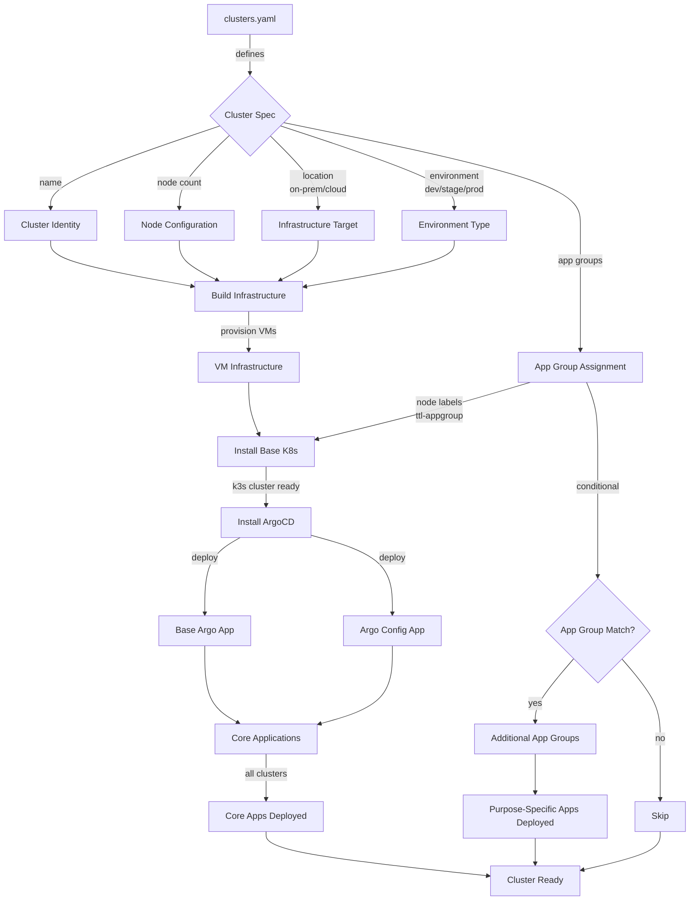

```mermaid
graph TD
    A[clusters.yaml] -->|defines| B{Cluster Spec}
    B -->|name| C[Cluster Identity]
    B -->|node count| D[Node Configuration]
    B -->|location<br/>on-prem/cloud| E[Infrastructure Target]
    B -->|environment<br/>dev/stage/prod| F[Environment Type]
    B -->|app groups| G[App Group Assignment]
    
    C --> H[Build Infrastructure]
    D --> H
    E --> H
    F --> H
    
    H -->|provision VMs| I[VM Infrastructure]
    
    I --> J[Install Base K8s]
    G -->|node labels<br/>ttl-appgroup| J
    
    J -->|k3s cluster ready| K[Install ArgoCD]
    
    K -->|deploy| L[Base Argo App]
    K -->|deploy| M[Argo Config App]
    
    L --> N[Core Applications]
    M --> N
    
    N -->|all clusters| O[Core Apps Deployed]
    
    G -->|conditional| P{App Group Match?}
    P -->|yes| Q[Additional App Groups]
    P -->|no| R[Skip]
    
    Q --> S[Purpose-Specific Apps Deployed]
    
    O --> T[Cluster Ready]
    S --> T
    R --> T
```