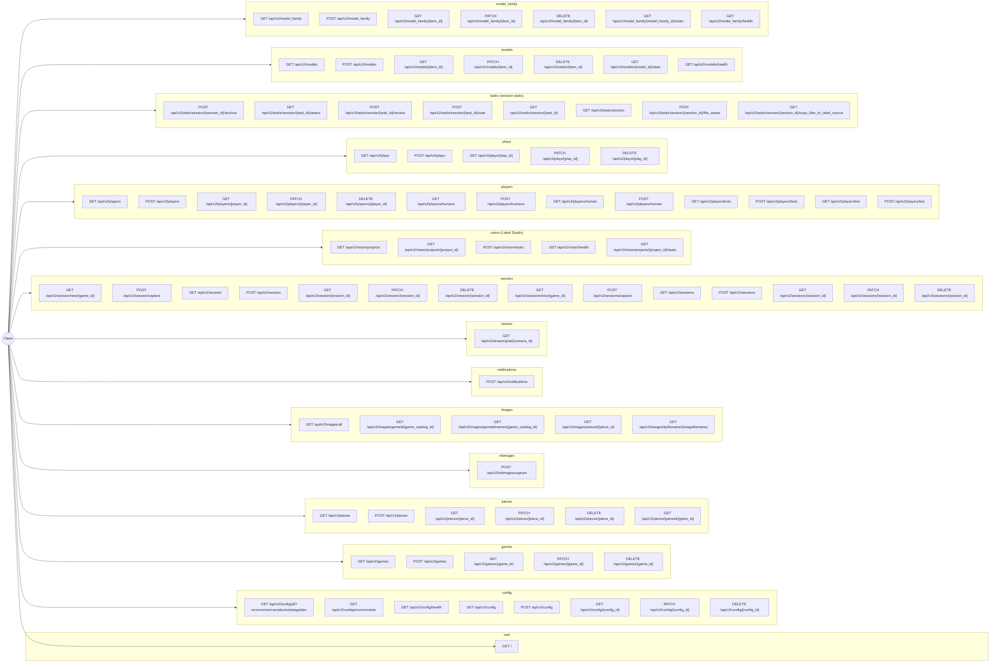

```mermaid
flowchart LR
  %% WOPR API v0.1.5-alpha (OpenAPI 3.1) - Endpoint Topology

  client((Client))

  subgraph ROOT["root"]
    root_get["GET /"]
  end

  subgraph CONFIG["config"]
    cfg_all["GET /api/v2/config/all?environment=production|stage|dev"]
    cfg_envs["GET /api/v2/config/environments"]
    cfg_health["GET /api/v2/config/health"]
    cfg_get["GET /api/v2/config"]
    cfg_post["POST /api/v2/config"]
    cfg_id_get["GET /api/v2/config/{config_id}"]
    cfg_id_patch["PATCH /api/v2/config/{config_id}"]
    cfg_id_del["DELETE /api/v2/config/{config_id}"]
  end

  subgraph GAMES["games"]
    games_get["GET /api/v2/games"]
    games_post["POST /api/v2/games"]
    game_get["GET /api/v2/games/{game_id}"]
    game_patch["PATCH /api/v2/games/{game_id}"]
    game_del["DELETE /api/v2/games/{game_id}"]
  end

  subgraph PIECES["pieces"]
    pieces_get["GET /api/v2/pieces"]
    pieces_post["POST /api/v2/pieces"]
    piece_get["GET /api/v2/pieces/{piece_id}"]
    piece_patch["PATCH /api/v2/pieces/{piece_id}"]
    piece_del["DELETE /api/v2/pieces/{piece_id}"]
    pieces_by_game["GET /api/v2/pieces/gameid/{game_id}"]
  end

  subgraph MLIMAGES["mlimages"]
    mlimages_cap["POST /api/v2/mlimages/capture"]
  end

  subgraph IMAGES["images"]
    imgs_all["GET /api/v2/images/all"]
    imgs_by_game["GET /api/v2/images/gameid/{game_catalog_id}"]
    imgs_by_game_names["GET /api/v2/images/gameid/names/{game_catalog_id}"]
    imgs_by_piece["GET /api/v2/images/pieceid/{piece_id}"]
    imgs_by_filename["GET /api/v2/images/byfilename/{imagefilename}"]
  end

  subgraph NOTIFICATIONS["notifications"]
    notif_post["POST /api/v2/notifications"]
  end

  subgraph STREAM["stream"]
    stream_grab["GET /api/v2/stream/grab/{camera_id}"]
  end

  subgraph SESSION["session"]
    session_new["GET /api/v2/session/new/{game_id}"]
    session_cap["POST /api/v2/session/capture"]
    session_get["GET /api/v2/session"]
    session_post["POST /api/v2/session"]
    session_id_get["GET /api/v2/session/{session_id}"]
    session_id_patch["PATCH /api/v2/session/{session_id}"]
    session_id_del["DELETE /api/v2/session/{session_id}"]

    %% duplicated plural routes in spec (kept as separate nodes so you see it)
    sessions_new["GET /api/v2/sessions/new/{game_id}"]
    sessions_cap["POST /api/v2/sessions/capture"]
    sessions_get["GET /api/v2/sessions"]
    sessions_post["POST /api/v2/sessions"]
    sessions_id_get["GET /api/v2/sessions/{session_id}"]
    sessions_id_patch["PATCH /api/v2/sessions/{session_id}"]
    sessions_id_del["DELETE /api/v2/sessions/{session_id}"]
  end

  subgraph VISION["vision (Label Studio)"]
    vision_projects["GET /api/v2/vision/projects"]
    vision_project["GET /api/v2/vision/projects/{project_id}"]
    vision_tasks_create["POST /api/v2/vision/tasks"]
    vision_health["GET /api/v2/vision/health"]
    vision_project_tasks["GET /api/v2/vision/projects/{project_id}/tasks"]
  end

  subgraph PLAYERS["players"]
    players_get["GET /api/v2/players"]
    players_post["POST /api/v2/players"]
    player_get["GET /api/v2/players/{player_id}"]
    player_patch["PATCH /api/v2/players/{player_id}"]
    player_del["DELETE /api/v2/players/{player_id}"]

    humans_get["GET /api/v2/players/humans"]
    humans_post["POST /api/v2/players/humans"]

    human_get["GET /api/v2/players/human"]
    human_post["POST /api/v2/players/human"]

    bots_get["GET /api/v2/players/bots"]
    bots_post["POST /api/v2/players/bots"]

    bot_get["GET /api/v2/players/bot"]
    bot_post["POST /api/v2/players/bot"]
  end

  subgraph PLAYS["plays"]
    plays_get["GET /api/v2/plays"]
    plays_post["POST /api/v2/plays"]
    play_get["GET /api/v2/plays/{play_id}"]
    play_patch["PATCH /api/v2/plays/{play_id}"]
    play_del["DELETE /api/v2/plays/{play_id}"]
  end

  subgraph TASKS["tasks (session tasks)"]
    task_archive["POST /api/v2/tasks/session/{session_id}/archive"]
    task_status["GET /api/v2/tasks/session/{task_id}/status"]
    task_revoke["POST /api/v2/tasks/session/{task_id}/revoke"]
    task_wait["POST /api/v2/tasks/session/{task_id}/wait"]
    task_get["GET /api/v2/tasks/session/{task_id}"]
    tasks_all["GET /api/v2/tasks/session"]
    task_file_status["POST /api/v2/tasks/session/{session_id}/file_status"]
    task_copy_files["GET /api/v2/tasks/session/{session_id}/copy_files_to_label_source"]
  end

  subgraph MODELS["models"]
    models_get["GET /api/v2/models"]
    models_post["POST /api/v2/models"]
    model_get["GET /api/v2/models/{item_id}"]
    model_patch["PATCH /api/v2/models/{item_id}"]
    model_del["DELETE /api/v2/models/{item_id}"]
    model_stats["GET /api/v2/models/{model_id}/stats"]
    models_health["GET /api/v2/models/health"]
  end

  subgraph MODEL_FAMILY["model_family"]
    mf_get["GET /api/v2/model_family"]
    mf_post["POST /api/v2/model_family"]
    mf_item_get["GET /api/v2/model_family/{item_id}"]
    mf_item_patch["PATCH /api/v2/model_family/{item_id}"]
    mf_item_del["DELETE /api/v2/model_family/{item_id}"]
    mf_stats["GET /api/v2/model_family/{model_family_id}/stats"]
    mf_health["GET /api/v2/model_family/health"]
  end

  %% Client edges (visual grouping)
  client --> root_get
  client --> CONFIG
  client --> GAMES
  client --> PIECES
  client --> MLIMAGES
  client --> IMAGES
  client --> NOTIFICATIONS
  client --> STREAM
  client --> SESSION
  client --> VISION
  client --> PLAYERS
  client --> PLAYS
  client --> TASKS
  client --> MODELS
  client --> MODEL_FAMILY
```