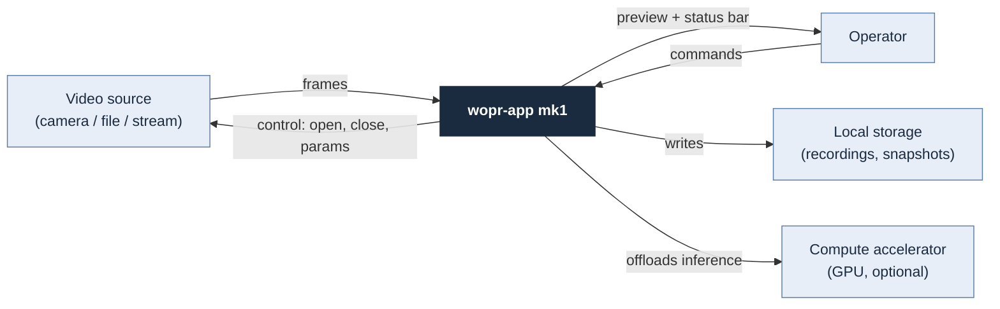
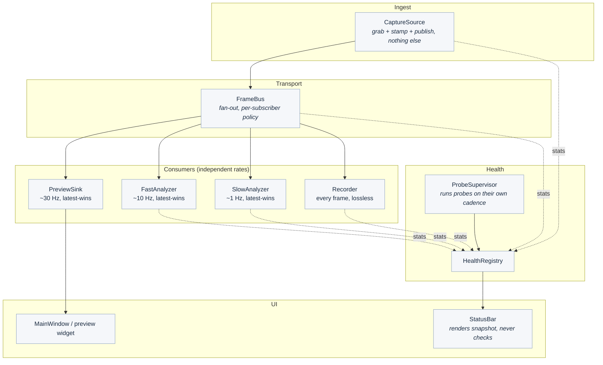
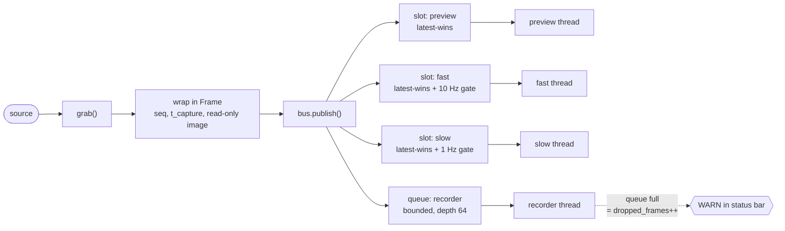
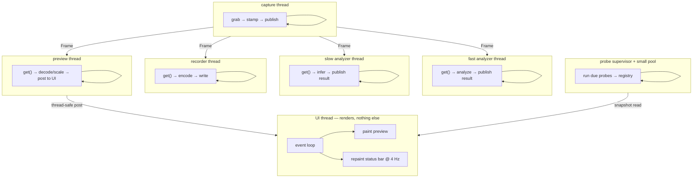
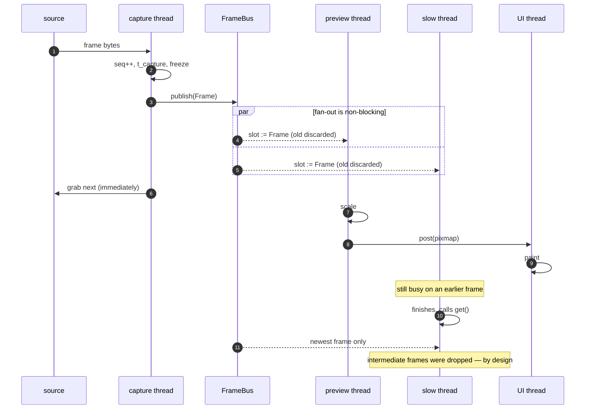
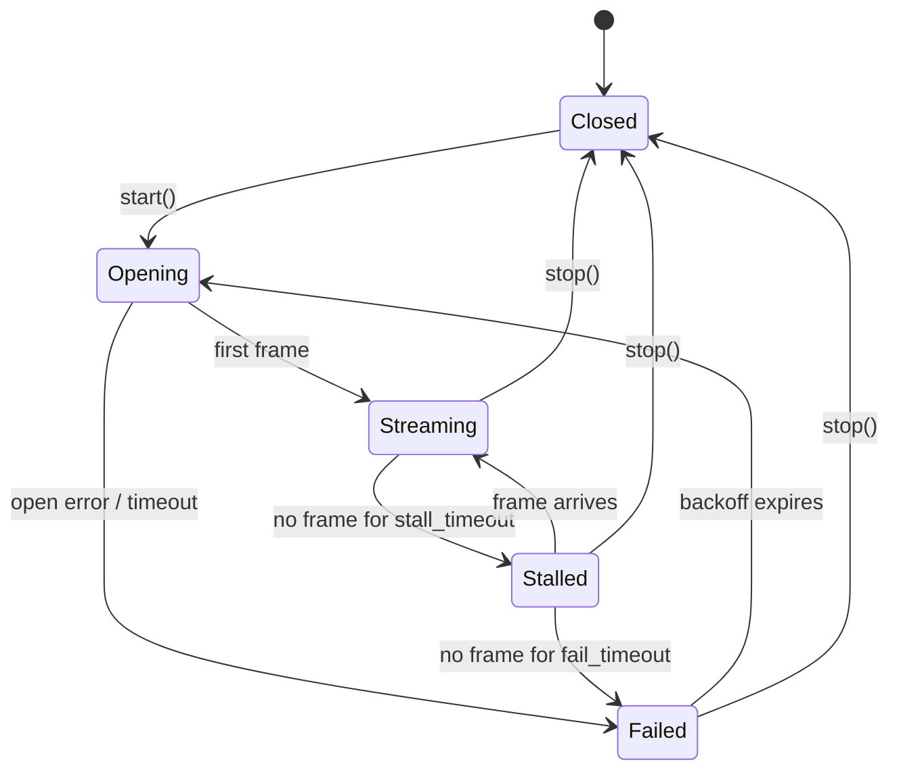
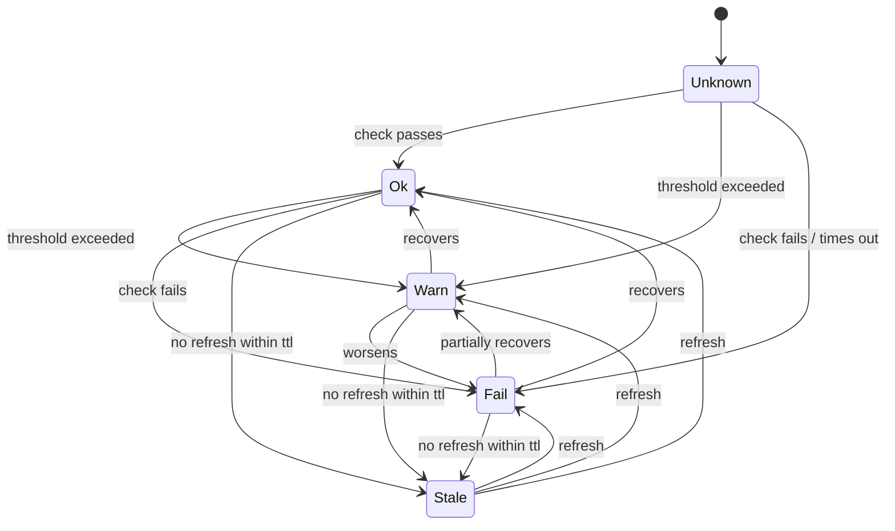
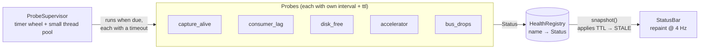

# wopr-app mk1 — Architecture

> Status: **draft**, written without access to the mk1 source. Module and class
> names here are placeholders. Structure should hold; names will not.
> Last updated: 2026-08-11

---

## 0. The process (the actual question)

There is a process, and it is not SDLC. For a single-operator app of this size,
architecture is **five artifacts and two rules**. Everything else is ceremony.

| # | Artifact | Answers | Where |
|---|----------|---------|-------|
| 1 | One-sentence purpose | What is this thing | §1 |
| 2 | Context diagram | What is *outside* the app | §2 |
| 3 | Component + dataflow diagram | What is *inside*, and how data moves | §3, §4 |
| 4 | Concurrency diagram | Who owns which thread, what crosses a boundary | §5 |
| 5 | State machines | The things that have modes | §6 |
| — | ADRs | Decisions worth not re-litigating at 1am | `ADRS.md` |
| — | Ordered backlog | Literally what to do Monday | `NEXT.md` |

This is [C4](https://c4model.com/) with the bottom two levels deleted. C4's
levels are Context → Container → Component → Code. Code-level diagrams rot
faster than the code does, and for one app the Container level collapses into
Component. So: two diagrams, plus concurrency, which C4 does not cover and
which is the part that actually bites.

**Rule 1 — if it cannot be drawn, it cannot be built.** An arrow with no name
on it is the next unknown. Go find out what that arrow is before writing code.

**Rule 2 — measure before restructuring.** Threading is a *response to a
measurement*, not a design goal. See `NEXT.md` step 0. There is a real chance
the measurement says "one thread is fine at 15 fps, add a rate limiter, go
home."

The old-school analogue: this is the same discipline as sketching the rack and
the cable runs before racking anything. The modern version just calls the
sketch a diagram-as-code file that lives next to the thing it describes and
gets reviewed in the same PR.

---

## 1. Purpose

> mk1 ingests a live image/video feed, lets several independent consumers work
> on the same frames at different rates, and surfaces the health of every
> moving part in a status bar.

Three nouns fall out of that sentence — **feed**, **consumers**, **health** —
and those are the three subsystems. That is not a coincidence; it is why the
sentence gets written first.

---

## 2. Context



Four external things. If a fifth shows up later (network sink, remote control
API, another camera), it goes here first — not into the code.

---

## 3. Components



Solid arrows are frames. Dotted arrows are counters. Keeping those two flows
visually distinct is the whole point — the counter path must never be able to
block the frame path.

The separation-of-concerns line here is the same one as *keep the OS image and
the data on different volumes*: **frame transport is not frame processing.**
The bus knows nothing about what a consumer does; a consumer knows nothing
about who else is subscribed. Change either side without touching the other.

---

## 4. The frame pipeline

### 4.1 The idea

The word "pipeline" is doing damage here. A pipeline implies A→B→C, where C
waits on B. That is the wrong shape for this. The right shape is a **fan-out
bus with per-subscriber drop policy**:

- one producer, N independent subscribers
- each subscriber has its **own** rate and its **own** buffer
- a slow subscriber *cannot* slow the producer or any peer
- for live video, **most consumers want the newest frame, not every frame**

That last point is the load-bearing one. A queue is the wrong primitive for a
live feed, because a queue's job is to *not lose things*, and a preview window
that renders a 4-second-old frame because it faithfully preserved every one is
worse than useless. The default primitive is a **single-slot latest-wins
mailbox**. A queue is the exception, granted only to consumers that genuinely
need every frame.

### 4.2 Flow



`publish()` is O(number of subscribers) pointer writes. It never copies pixels,
never blocks, never allocates per subscriber. If it ever does any of those
three, the design has drifted.

### 4.3 Consumer classes

| Class | Policy | Buffer | On overrun | Example |
|-------|--------|--------|-----------|---------|
| Display | latest-wins | 1 | silently drop old | preview widget |
| Fast analyzer | latest-wins + rate gate | 1 | silently drop old | motion, exposure |
| Slow analyzer | latest-wins + rate gate | 1 | silently drop old | detection, OCR |
| Lossless | keep-all | bounded queue | **count it, raise WARN** | recorder, forensics |

The lossless row is the one that breaks naive designs. It is the only consumer
allowed a real queue, and it is the only one whose drops are an *incident*
rather than normal operation. Bounded, never unbounded — an unbounded queue
does not solve backpressure, it converts a latency problem into an OOM at 3am.

### 4.4 Contract: the frame envelope

```python
from dataclasses import dataclass, field
from typing import Any, Mapping
import numpy as np

@dataclass(frozen=True)
class Frame:
    seq: int                  # monotonic, per source, never reused
    t_capture: float          # time.monotonic() at grab, NOT wall clock
    source_id: str
    image: np.ndarray         # flags.writeable = False
    meta: Mapping[str, Any] = field(default_factory=dict)
```

Three rules, and they are what make the lock-free fan-out legal:

1. **Frames are immutable.** Set `image.flags.writeable = False` at
   construction. This is not a style preference; it is what allows N threads to
   hold the same buffer with zero synchronisation.
2. **A consumer that needs to modify pixels copies first.** Its copy is its own
   business and never goes back on the bus.
3. **`t_capture` is monotonic, not wall clock.** NTP steps and DST have no
   business in a latency calculation. Convert to wall clock only at the display
   or log boundary.

`seq` earns its keep three ways: gap detection (frames lost upstream),
staleness (`last_seq` per consumer vs. bus `seq`), and reproducible debugging
("it breaks on frame 41,203").

### 4.5 Contract: the bus

```python
from typing import Literal, Protocol

@dataclass(frozen=True)
class Policy:
    mode: Literal["latest", "all"] = "latest"
    max_hz: float | None = None     # None = as fast as frames arrive
    depth: int = 1                  # only meaningful when mode == "all"

@dataclass
class ConsumerStats:
    received: int = 0
    dropped: int = 0
    last_seq: int = -1
    last_latency_ms: float = 0.0    # now - frame.t_capture at handoff
    errors: int = 0

class Subscription(Protocol):
    name: str
    def get(self, timeout: float | None = None) -> Frame | None: ...
    def stats(self) -> ConsumerStats: ...
    def close(self) -> None: ...

class FrameBus(Protocol):
    def publish(self, frame: Frame) -> None: ...
    def subscribe(self, name: str, policy: Policy) -> Subscription: ...
```

That is the entire public surface. Roughly 60–80 lines of implementation for
the latest-wins case (a `Condition` and one slot per subscriber). If it grows a
plugin registry, a config DSL, or a priority scheduler, something has gone
wrong — see the "Known ways this goes wrong" section.

---

## 5. Concurrency

### 5.1 Thread ownership



Four rules:

1. **The capture thread does no work.** Grab, stamp, publish. Anything that
   blocks in there starves every consumer at once.
2. **The UI thread does no I/O and no pixel math.** It paints. Results reach it
   through the framework's thread-safe post mechanism (Qt signals,
   `after()`/queue in Tk, `GLib.idle_add` in GTK). Never touch a widget from a
   worker thread — the failure mode is a silent corruption or a crash three
   minutes later, which is the worst kind.
3. **Threads share nothing but immutable frames and counter structs.** No
   shared mutable state means no lock ordering, which means no deadlocks. If a
   lock shows up outside the bus internals, that is a design smell worth a
   second look.
4. **One stop event, everyone joins with a timeout.** Written on day one, not
   after the first hung Ctrl-C.

### 5.2 One frame, end to end



Steps 8–11 are the whole point of the design. The slow consumer misses frames
and that is the *correct* behaviour, not a bug to be fixed with a bigger
buffer.

---

## 6. State machines

### 6.1 Capture source



`Stalled` is the state that gets skipped and then costs a weekend. A USB camera
that stops delivering without erroring looks identical to a healthy idle one
unless something is watching frame *age*. Reconnect backoff should be capped
and jittered — a tight reconnect loop against a wedged device is a fine way to
hang the USB bus.

### 6.2 Health probe



**`Stale` is not optional.** Without it, a probe thread that dies leaves its
last result on screen forever, and a status bar that is confidently green
because nothing has checked since Tuesday is worse than no status bar at all.
The staleness check belongs in the *reader* (`snapshot()`), not the writer —
a dead writer cannot mark itself dead.

---

## 7. Health & status bar

### 7.1 Shape

Pull-based, not push-based. Probes are polled on their own cadence by a
supervisor; the status bar renders whatever the registry currently holds. The
status bar never calls `check()`, because the moment a UI repaint can invoke a
`stat()` on a network mount, the UI can freeze.



### 7.2 Contract

```python
from enum import Enum
from typing import Protocol

class State(Enum):
    OK = "ok"
    WARN = "warn"
    FAIL = "fail"
    STALE = "stale"       # applied by the registry, never returned by a probe
    UNKNOWN = "unknown"   # never run yet

@dataclass(frozen=True)
class Status:
    state: State
    detail: str           # short, human, fits in a tooltip
    t_checked: float      # time.monotonic()
    latency_ms: float = 0.0

class Probe(Protocol):
    name: str
    interval_s: float     # how often to run
    timeout_s: float      # hard cap; exceeding it is a FAIL, not a hang
    ttl_s: float          # past this without refresh → STALE (rule: >= 3x interval)

    def check(self) -> Status: ...

class HealthRegistry(Protocol):
    def register(self, probe: Probe) -> None: ...
    def snapshot(self) -> Mapping[str, Status]: ...   # cheap, non-blocking, TTL applied
```

Three invariants:

- `check()` **must** respect `timeout_s`. A probe that can hang is a probe that
  takes the supervisor with it. Run probes in a small pool so one slow probe
  cannot delay its peers.
- `snapshot()` is a **cheap dict copy**. The UI calls it several times a second.
- Probes never touch the UI. They return a value; that is all.

### 7.3 Starting probe set

| Probe | Checks | WARN | FAIL |
|-------|--------|------|------|
| `capture_alive` | age of newest frame; seq advancing | age > 2× frame interval | age > stall_timeout |
| `consumer_lag` | per-consumer `last_seq` vs bus `seq` | lag > 2× expected for its rate | consumer not advancing at all |
| `bus_drops` | recorder queue drops (lossless only) | any drop in last minute | sustained drops |
| `disk_free` | free bytes on the recording volume | < 10% or < 30 min of footage | < 2% or write error |
| `accelerator` | device present, driver responds | present but falling back to CPU | expected and absent |

Most of these read counters that already exist because of §4.5. That is the
argument for `ConsumerStats`: instrument at the boundary once, and the health
subsystem is mostly a rendering problem afterwards.

### 7.4 Rendering

- Repaint on a **timer**, not on every status change. 4 Hz is plenty; humans
  cannot read faster and a flapping probe should not be able to drive the paint
  loop.
- Worst state wins for any rolled-up indicator. `STALE` outranks `OK`.
- The one-line detail belongs in a tooltip; the bar itself gets a name and a
  colour.
- Colour is never the only signal — shape or glyph too. Roughly 8% of men have
  some form of colour vision deficiency, and red/green is the common one.

---

## 8. Known ways this goes wrong

Listed because these are the failure modes worth watching for, not because
they are inevitable.

1. **Threading added without a measurement.** Under CPython's GIL, threads help
   when the work releases the GIL — OpenCV, NumPy, encoders, and I/O all do.
   Pure-Python per-pixel work does not, and threading it buys nothing but new
   race conditions. Step 0 in `NEXT.md` exists to settle this with data.
2. **The bus growing a framework.** Two consumers do not need a plugin system.
   `publish` / `subscribe` / `get` / `stats` is the whole API. Adding priorities
   or a config DSL before there is a second reason to is speculative work.
3. **Unbounded queues.** Converts a visible latency problem into an invisible
   memory problem that surfaces as an OOM kill hours later.
4. **A widget touched from a worker thread.** Works in testing, corrupts in
   production, crashes somewhere unrelated. Always post through the framework.
5. **Status without staleness.** Covered in §6.2. The most common monitoring
   bug there is.
6. **Wall clock in latency math.** An NTP step makes latency negative and the
   status bar go red for reasons no log will ever explain.
7. **Shutdown left for later.** Then Ctrl-C hangs, the camera stays locked, and
   the next run cannot open the device.

---

## 9. Open questions

Arrows that do not yet have names — the Rule 1 backlog.

- What is the frame source in practice? V4L2 device, RTSP, file, or several?
  Reconnect semantics differ a lot between them.
- Is the recorder in scope for mk1, or later? It is the only consumer that
  forces a real queue, so its presence changes the bus's minimum design.
- What does a "status check" cover beyond the pipeline — external services,
  mounts, anything off-box? Off-box probes need generous timeouts and their own
  pool.
- Single source, or several? Multi-source turns `FrameBus` into
  `FrameBus[source_id]`, which is cheap to design in now and expensive to
  retrofit.
- Where does analyzer *output* go? Overlaid on preview, into the status bar,
  logged? That is a second, much smaller bus, and it should not be
  hand-wired into the first one.
